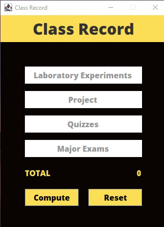

# Event Driven Programming - Class Record

## Table of contents

- [Overview](#overview)
  - [Screenshot](#screenshot)
- [My process](#my-process)
  - [Built with](#built-with)
  - [What I learned](#what-i-learned)
- [Author](#author)
- [Acknowledgments](#acknowledgments)

## Overview

### Screenshot

#### Planets Preview
---

## My process

### Built with

- Java Swing

### What I learned

Learned to use Java Swing to create a simple interactive GUI application that calculates a total grade based on specific weightings and provides feedback on whether the student has passed or failed.

## Author

- Website - [Shanice](https://github.com/sdacleofe/about-me)

## Acknowledgments

I want to express my gratitude to my event-driven programming course instructor for imparting knowledge about the concept of Java GUI to us.

**This laboratory activity was made on March 2, 2022**